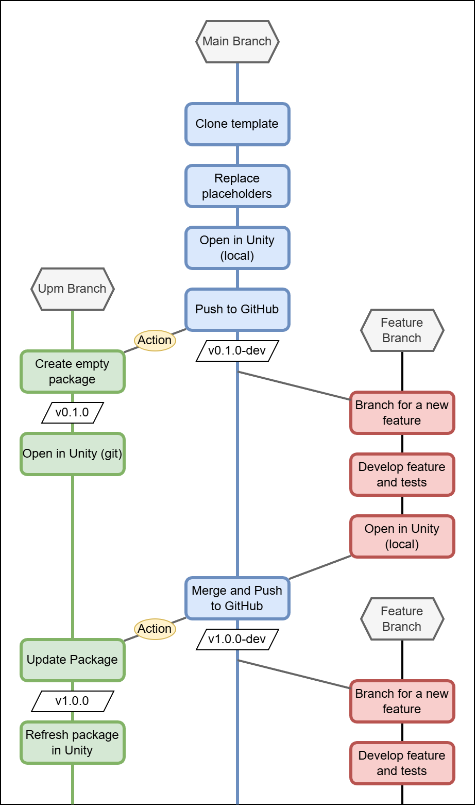

# Development Workflow

This repository suggests a lightweight branching strategy inspired by GitHub Flow ([ref1][githubflow], [ref2][github-docs-githubflow]), with an additional branch dedicated to distributing the project as a Unity UPM package.

The goal is to keep development simple, predictable, and automation‑friendly while ensuring that the main branch always reflects the most stable version of the software.

## Branches Description

### main
- Contains the **most advanced stable version** of the software.
- All feature development is merged into this branch through pull requests.
- Acts as the single source of truth for the project.
- Ideally, this branch can be modified only with Pull Requests.

### upm
- Contains the same codebase as `main`, but **converted into a UPM‑compatible package**.
- This branch is **automatically updated** by GitHub Actions whenever `main` changes.
- Should never be edited manually.
- Ideally, this branch can be modified only by GitHub Actions.

### feature/<feature_name>
- Temporary branches created from `main` to develop new features or improvements.
- Follows the naming convention: `feature/<feature_name>`
- Merged back into `main` once the feature is complete and reviewed.

## Process Description

1. **Initial Setup**  
   The user initializes the repository and replace the placeholders.

2. **UPM Package Initialization**  
   A GitHub Action runs automatically, generating the initial (empty) UPM package and committing it to the `upm` branch.

3. **Create a Feature Branch**  
   For each new feature, the user creates a branch from `main`, like `feature/<feature_name>`.

4. **Develop the Feature**  
   All changes related to the feature are implemented on the corresponding `feature/<feature_name>` branch.

5. **Merge Back Into `main`**  
   Once the feature is complete, the branch is merged into `main` through a pull request.

6. **UPM Package Update**  
   After the merge, the GitHub Action runs again, regenerating the UPM package and updating the `upm` branch to stay aligned with `main`.

7. **Repeat for Each New Feature**  
   For the next feature, return to step 3 and repeat the cycle.

A sample schema of the overall workflow is shown below.

Back to [Documentation Hub](../index.md)

[githubflow]: https://githubflow.github.io "GitHub Flow"
[github-docs-githubflow]: https://docs.github.com/en/get-started/using-github/github-flow "GitHub Docs - GitHub Flow"
